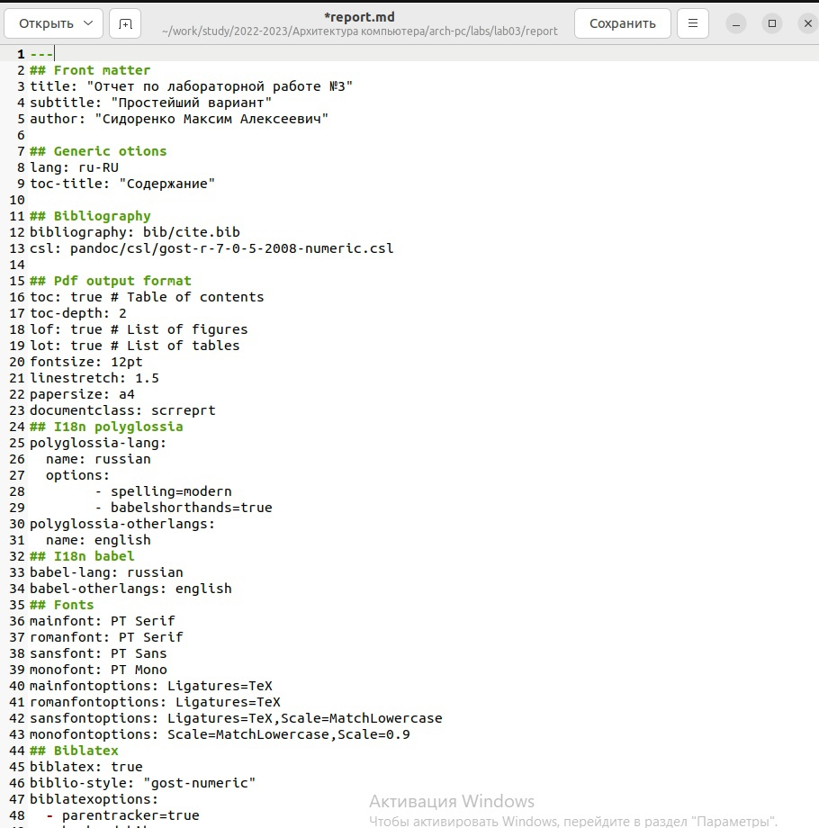

---
## Front matter
title: "Отчет по лабораторной работе №3"
author: "Сидоренко Максим Алексеевич"

## Generic otions
lang: ru-RU
toc-title: "Содержание"

## Bibliography
bibliography: bib/cite.bib
csl: pandoc/csl/gost-r-7-0-5-2008-numeric.csl

## Pdf output format
toc: true # Table of contents
toc-depth: 2
lof: true # List of figures
lot: true # List of tables
fontsize: 12pt
linestretch: 1.5
papersize: a4
documentclass: scrreprt
## I18n polyglossia
polyglossia-lang:
  name: russian
  options:
	- spelling=modern
	- babelshorthands=true
polyglossia-otherlangs:
  name: english
## I18n babel
babel-lang: russian
babel-otherlangs: english
## Fonts
mainfont: PT Serif
romanfont: PT Serif
sansfont: PT Sans
monofont: PT Mono
mainfontoptions: Ligatures=TeX
romanfontoptions: Ligatures=TeX
sansfontoptions: Ligatures=TeX,Scale=MatchLowercase
monofontoptions: Scale=MatchLowercase,Scale=0.9
## Biblatex
biblatex: true
biblio-style: "gost-numeric"
biblatexoptions:
  - parentracker=true
  - backend=biber
  - hyperref=auto
  - language=auto
  - autolang=other*
  - citestyle=gost-numeric
## Pandoc-crossref LaTeX customization
figureTitle: "Рис."
tableTitle: "Таблица"
listingTitle: "Листинг"
lofTitle: "Список иллюстраций"
lotTitle: "Список таблиц"
lolTitle: "Листинги"
## Misc options
indent: true
header-includes:
  - \usepackage{indentfirst}
  - \usepackage{float} # keep figures where there are in the text
  - \floatplacement{figure}{H} # keep figures where there are in the text
---

# Цель работы

Целью работы является освоение процедуры оформления отчетов с помощью
легковесного языка разметки Markdown

# Задание

Заполнить отчет и скомпилировать его с использованием Makefile

# Теоретическое введение

Markdown

В табл. приведено краткое описание Символов и сочетаний Markdown.

: Описание некоторых символов и сочетания Markdown{#tbl:std-dir}

| Символ       |  Описание        Опвввввввввв                                                                                                          |
|--------------|----------------------------------------------------------------------------------------------------------------------------|
| `*`          | Создает заголовок файловую                                                                                    |
| `**.** `     | Задает курсивное начертание                                                |
| `***.***`    | Задает полужирное и курсивное начертание                                                                                  |

Более подробно об Markdown см. в [@gnu-doc:bash;@newham:2005:bash;@zarrelli:2017:bash;@robbins:2013:bash;@tannenbaum:arch-pc:ru;@tannenbaum:modern-os:ru].

# Выполнение лабораторной работы

Заполняю отчет (рис. [-@fig:001])

{ #fig:001 width=70% }

# Выводы

После проделанной работы мы освоили процедуры оформления отчетов с помощью легковесного языка разметки Markdown

# Список литературы{.unnumbered}

::: {#refs}
:::
